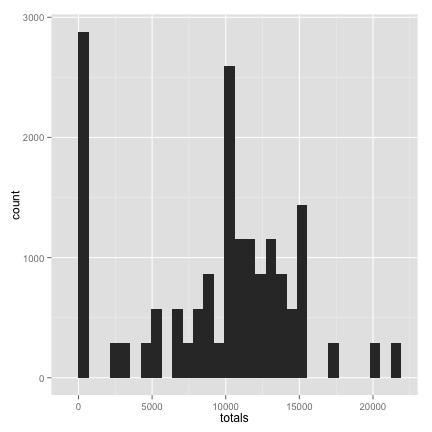
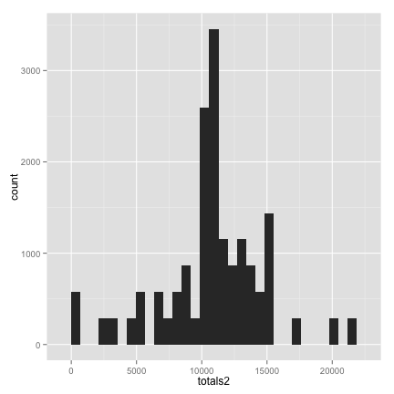
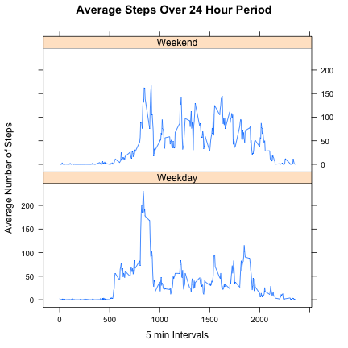

# Reproducible Research: Peer Assessment 1

Before starting the project, I will set the global options for this Rmd document:

```r
opts_chunk$set(echo = TRUE, fig.width = 6, fig.height = 6)
```


## Loading and preprocessing the data
Load the data set and indicate that "NA" valuse should be considered as missing values.

```r
data <- read.csv("activity.csv", header = TRUE, na.strings = "NA")
head(data)
```

```
##   steps       date interval
## 1    NA 2012-10-01        0
## 2    NA 2012-10-01        5
## 3    NA 2012-10-01       10
## 4    NA 2012-10-01       15
## 5    NA 2012-10-01       20
## 6    NA 2012-10-01       25
```


## What is mean total number of steps taken per day?

I will determine the number of steps taken each day by looping through each day, collect all the 
"steps" values for each 5 min interval in a list. The resulting list will contain 61 vectors (one
for each day in the data set) where each vector contains 288 "step" values for each 5 min interval in 
the 24 hour day. I will collect sum total number of steps that were taken for each day in a "totals" 
vector.

```r
steps_day <- list()
totals <- vector(mode = "numeric")
dates <- levels(data$date)
for (i in 1:length(dates)) {
    steps_day[[i]] <- data[data$date == dates[i], "steps"]
    totals[i] <- sum(steps_day[[i]], na.rm = TRUE)
}
```


First I will plot a histogram of the total number of steps taken each day.

```r
library(ggplot2)
p <- ggplot(data = data, aes(x = totals))
p + geom_histogram()
```

```
## stat_bin: binwidth defaulted to range/30. Use 'binwidth = x' to adjust this.
```

 


With the new variables created in the loop above, I can answer the questions: what are the mean and median number
of steps taken per day.

```r
mean_per_day <- mean(totals, na.rm = TRUE)
median_per_day <- median(totals, na.rm = TRUE)
mean_per_day
```

```
## [1] 9354
```

```r
median_per_day
```

```
## [1] 10395
```


## What is the average daily activity pattern?

To make a time series plot, I will find the mean number of steps for 5-min interval over all the 
days in the dataset.


```r
steps_day_df <- as.data.frame(steps_day)
colnames(steps_day_df) <- dates
ave_steps_interval <- apply(steps_day_df, 1, mean, na.rm = TRUE)
```


To plot these data, I will create a vector for the 5-min interval time stamps. 

```r
interval_vals <- data$interval[1:288]
```


Now I can plot the interval values on the x-axis and the number of steps on the y-axis.

```r
plot(interval_vals, ave_steps_interval, type = "l", xlab = "Intervals", ylab = "Average Number of Steps", 
    main = "Average Number of Steps Per Day")
```

 


Find which 5-minute interval, on average across all the days in the dataset, contains the maximum number of steps?

```r
interval_vals[which.max(ave_steps_interval)]
```

```
## [1] 835
```

This "interval number" is 835, which indicates 8:35 AM is the time when this person is most active on average.


## Imputing missing values

Find how many missing values (rows) are in the dataset?

```r
length(which(is.na(data$steps)))
```

```
## [1] 2304
```


I will impute the missing values with the average number of steps (for each 5-min interval) across all the days in the data set (that do contain values). Create a new data set, "data_imputed", that is reflects the original data set, but includes the imputed values.

```r
names(ave_steps_interval) <- interval_vals
missing <- ave_steps_interval[as.character(data[which(is.na(data$steps)), "interval"])]

data_imputed <- data
data_imputed[which(is.na(data$steps)), "steps"] <- missing
head(data_imputed)
```

```
##     steps       date interval
## 1 1.71698 2012-10-01        0
## 2 0.33962 2012-10-01        5
## 3 0.13208 2012-10-01       10
## 4 0.15094 2012-10-01       15
## 5 0.07547 2012-10-01       20
## 6 2.09434 2012-10-01       25
```


Like above, plot a histogram of the total number of steps taken each day (using the imputed data).

```r
steps_day2 <- list()
totals2 <- vector(mode = "numeric")
for (i in 1:length(dates)) {
    steps_day2[[i]] <- data_imputed[data_imputed$date == dates[i], "steps"]
    totals2[i] <- sum(steps_day2[[i]], na.rm = TRUE)
}
library(ggplot2)
p <- ggplot(data = data_imputed, aes(x = totals2))
p + geom_histogram()
```

```
## stat_bin: binwidth defaulted to range/30. Use 'binwidth = x' to adjust this.
```

 


Find the mean and median values for the total number of steps taken per day using the imputed data set.

```r
mean_per_day_imputed <- mean(totals2, na.rm = TRUE)
median_per_day_imputed <- median(totals2, na.rm = TRUE)
mean_per_day_imputed
```

```
## [1] 10766
```

```r
median_per_day_imputed
```

```
## [1] 10766
```

These numbers do differ from the original data slightly. In the original data, the mean = 9354, and median = 10395 number of steps. After imputing the data, the new mean = 10766 and new median = 10766. It's a little odd that after imputing the values, the mean and median were the same, but this is because so many days are missing, the "average values" become a significant factor in the imputed data.


## Are there differences in activity patterns between weekdays and weekends?


Create a new factor variable in the dataset with two levels – “weekday” and “weekend” indicating whether a given date is a weekday or weekend day. First, use the weekdays() function to determine the days of the week, and create a data frame with these weekday and weekend factors.

```r
dates2 <- as.Date(data_imputed$date)
dates3 <- weekdays(dates2)
dates3[dates3 == "Sunday" | dates3 == "Saturday"] <- "Weekend"
dates3[dates3 != "Weekend"] <- "Weekday"
data_imputed$week <- factor(dates3)


steps_day_df2 <- as.data.frame(steps_day2)
dates_week <- weekdays(as.Date(dates))
dates_week[dates_week == "Sunday" | dates_week == "Saturday"] <- "Weekend"
dates_week[dates_week != "Weekend"] <- "Weekday"
colnames(steps_day_df2) <- dates_week

steps_day_df2_weekend <- steps_day_df2[, colnames(steps_day_df2) == "Weekend"]
steps_day_df2_weekday <- steps_day_df2[, colnames(steps_day_df2) == "Weekday"]


ave_steps_interval_weekend <- apply(steps_day_df2_weekend, 1, mean, na.rm = TRUE)
ave_steps_interval_weekday <- apply(steps_day_df2_weekday, 1, mean, na.rm = TRUE)


# Make df
weekend_df <- data.frame(interval_vals, ave_steps_interval_weekend)
weekend_df$week <- rep("Weekend", 288)
colnames(weekend_df) <- c("interval_vals", "ave_steps_interval", "week")
weekday_df <- data.frame(interval_vals, ave_steps_interval_weekday)
weekday_df$week <- rep("Weekday", 288)
colnames(weekday_df) <- c("interval_vals", "ave_steps_interval", "week")
week_df <- rbind(weekend_df, weekday_df)
```


Make a panel plot containing a time series plot (i.e. type = "l") of the 5-minute interval (x-axis) and the average number of steps taken, averaged across all weekday days or weekend days (y-axis).

```r
library(lattice)
xyplot(ave_steps_interval ~ interval_vals | week, type = "l", layout = c(1, 
    2), main = "Average Steps Over 24 Hour Period", xlab = "5 min Intervals", 
    ylab = "Average Number of Steps", data = week_df)
```

 


It's clear that this person is most active in the morning around 8:30 AM on both the weekends and weekdays. However, this person is generally more active on the weekends, suggesting this person's job is sedentary.


